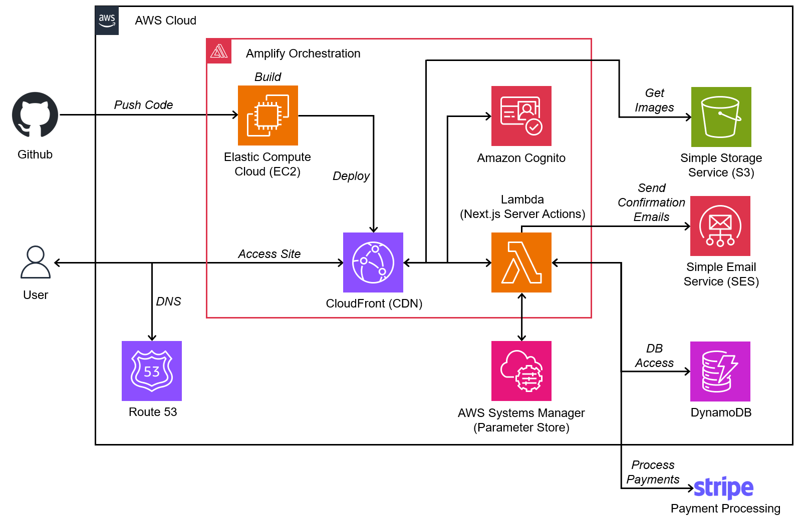
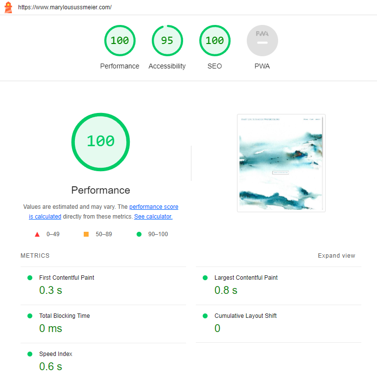
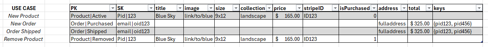
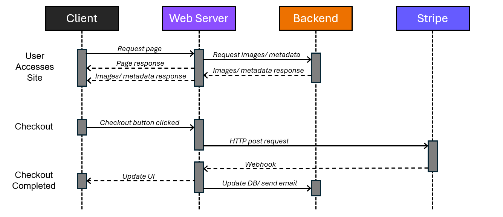

## 
 Fullstack Website Design for www.marylousussmeier.com 

My mom is a very talented watercolor artist who has been painting for as long as I can remember. She has been successful in selling her artwork at craft fairs and other local events for the past few years. Since I had some experience with full-stack web design from my real estate timeseries project, I told her I could code her up a storefront website largely from scratch instead of using something like Shopify. It turns out this was harder than I thought. This readme is a full write-up of my design choices and my experience working with many technologies new to me to complete the site and help my mom realize her dream of becoming a successful watercolor artist. 

#### Primary Stack:
- Next.js 14
- Typescript
- Tailwind
- AWS Amplify
- DynamoDB
- S3
- Stripe

## 
 Architecture Diagram 

## 
 Frontend 

The frontend portion of the website uses Next.js 14, Typescript, and Tailwind. Next.js is a framework built on top of React, which is the most popular and well-documented Javascript framework on the planet. Next.js enables server-side rendering (SSR) and static-site generation (SSG). This makes the site load faster because instead of sending the code needed to render the site, the code has already been executed on the webserver so it is only shipping the finished product when a user clicks to access the site. While this may seem like extra work for only a fraction of a second saved on initial page load, it greatly improves search engine optimization. A faster load time indicates to search engine crawlers that the page may provide a better user experience, and is therefore more relevant in page rankings. Google Lighthouse is a common tool for analyzing performance and can be used to “grade” my work. Below is a screenshot Lighthouse which indicates very good performance. 

    

  
The use of a content delivery network (CDN) also greatly improves performance. This will be covered in the next section.

Typescript is a statically typed superset of Javascript with optional type annotations, which can help reduce the risk of misusing variables and introducing bugs. Typescript is quickly becoming an industry standard, so it was worth it for me to switch over from Javascript. 

Lastly, Tailwind is used for in place of standard CSS which styles components on the page to make things look pretty, and makes the pages reactive to different screen sizes. Again, this may seem like extra steps for no reason (like many things in the Javascript/ webdev world) but it made things a whole lot easier once I got used to it.

## 
 AWS Amplify 

Amplify is a full-stack web development tool that handles hosting and continuous integration/ continuous deployment (CI/CD) automatically. This is useful because I don’t have to worry about configuring web servers, and the website won’t stop working when I update the code. 
Amplify uses a CDN to automatically distribute the website to a global network of servers. This means that the site can scale with traffic, and the webservers are physically located closer to end-users so there is a substantial decrease in latency.

A note on GraphQL and AWS Appsync: Amplify makes it easy to implement APIs through GraphQL, where the coordination of requests and responses is handled through Appsync. GraphQL provides a single endpoint for an API, which can simplify middleware when compared to the RESTful approach where multiple endpoints are required for different requests. At first, I was using GraphQL for my API, but I switched off of it for a few reasons:
1.	Custom GraphQL resolvers appear inefficient for my use case. A resolver is used to implement custom business logic that needs to take place between a clients request and a sequence of required tasks that take place on the backend. A simple example: I need to write a custom query to my backend. Instead of having this handled directly in Appsync, I need to write a lambda function to perform the query. If I have several resolvers that don’t get used consistently, then they will only spin up when they are called. This takes extra time leading to a cold-start problem for every resolver. A solution could be to integrate this directly into Appsync, but this leads me to my next problem.
2.	Custom resolvers for direct use within Appsync need to be written in a language called Velocity Template Language (VTL). Like me, you have probably never heard of this. It does not appear to be very common, so documentation is limited and I do not want to go through the trouble of learning something that I’ll likely never use again.
3.	The better approach: Next.js server actions. I can skip configuring a GraphQL API completely by using a new technology that I am willing to bet becomes an industry standard.
## 
 Middleware 

All middleware is implemented directly in my source code through the use of Next.js server actions. As the name implies, I can run code on the server that can talk directly to my backend. I can invoke a server action from the front-end the same way I would call a standard function in Typescript. This greatly simplifies the interaction between the client and my database, object storage, and Simple Email Service (SES).
## 
 Security 

The admin dashboard is the only page of the website protected by password. I used the built-in authentication library from Amplify (which uses Cognito behind the scenes) to manage admin accounts. 

Sensitive environment variables are encrypted and stored in AWS System Manager’s Parameter Store. These are only available in code that is run on the server, so nothing is exposed to the client.

This project was done with <i>least privileged access</i> in mind. Services and functions only have access to what they need to run properly.

Stripe is used for payment processing. This means no sensitive payment details are ever accessible or stored by my application.

## 
 Database 

Now to the fun stuff. I decided to do single-table design in DynamoDB for my backend database. Why? Because I wanted to. In a situation where I am building a relatively basic webapp (from a database perspective) and I do not expect it to scale to millions of daily active users, my first pick would be a relational database. When relational tables are small and there isn’t much traffic, a relational database would actually perform better and would have more straightforward SQL queries. Since I have already used a relational database in a previous project, I wanted to get more experience with NoSQL in this current project.

#### 
 Single-Table Design in Key-Value Databases 

The advantage to this design pattern is practically infinite scaling capabilities at a low cost, but this comes with a massive caveat. There is no “one approach fits all”, the design of the table is largely dependent on your data access patterns. With a relational database, the design strategy is well understood—3rd normal form your tables and figure out how to get the data you need with SQL queries. Relational database technology is by far the most mature and well-documented approach to storing online transaction processing (OLTP) data. DynamoDB is a different game. Before you design the table, it is imperative that you think through all the different ways data will need to be accessed. In a way it is the opposite of relational—figure out all the queries, and then design the table. This is due to the fact that that everything in the table must be accessed through a combination of a partition key (PK) and a sort key (SK). 

#### 
 Database Use Case Snippet 

Above is a table showing the primary use cases that inform the database queries written in the server actions section of the codebase. Instead of doing a scan operation, which looks through the entire database everytime it is called, all data can be queried by knowing the PK and sorting with the SK.

Those familiar with key-value DB design may have spotted a problem. In a case where there are <i>many</i> orders (active or processed) or <i>many</i> products (active or inactive), there will be a “hot” partition because these are grouped by partition key. A hot partition is when one partition continues to grow, instead of having that data being spread across several partitions. This will eventually impact performance and could break the database. However, I do not expect this to become a problem. At least not for a while. In the case where the data needs to be split, adding in something like the month/ year combination (ie user123|id123|5/24) would split it up, it would just need to be queried more carefully.

## 
 Sequence Diagram for Checkout Process 

<b>User accesses site:</b> When a user clicks on a link to the webpage, a DNS request is made to look up the IP address of the server, and then the request is passed to the server. The server will first respond by sending the pre-rendered HTML/CSS code for the homepage, and then images and metadata for the paintings are loaded asynchronously. All metadata is loaded at once, but images are lazy loaded which means that they only load as the user scrolls down to them (this reduces initial load time).

<b>Checkout:</b> When the checkout button is pressed, the web server makes an HTTP request to a Stripe endpoint which will redirect the user to the Stripe checkout page. This HTTP request includes a payment ID so that Stripe knows what is being purchased, and it includes metadata about the paintings being purchased so that this information can be passed back to update the database if payment is successful.

<b>Checkout completed:</b> When the payment information is verified by Stripe, a webhook payload is sent back to the web server that is listening for a response. If the payment is successful, the user is redirected to a success page, the database is updated, the painting(s) is marked as sold so others cannot purchase it, the cart is emptied, and a confirmation email is sent using SES. If the payment fails, the user is redirected to a canceled page and their cart is not emptied in case they want to try again.

## 
 Cost 

- Domain Name: $15 one-time purchase
- DNS hosting: $0.50/month
- Amplify hosting: ~$2-$3/month
- Stripe: 2.9% of purchase price + $0.30
- All other services: Basically free

This is quite a bit cheaper than a website builder service which ranges from $20/month to $80/month with additional charge fees. 

## 
 Miscellaneous 

A robots.txt file has been added to allow all bot traffic from web crawlers to access the site, and Google Analytics is used to monitor traffic.

I am not using default build settings or caching settings (this is not contained in the source code). I have set the caching behavior to be more aggressive so that the CDN retains static files for longer, and I have performance mode enabled (Amplify setting) which decreases latency but also increases the time it takes to invalidate the cache when changes are pushed through from Github.

I did not use any AI to write this readme, but I did use AI to write some of the code. I have strong opinions about the appropriate application of AI, and right now it is only useful as a fancy autocomplete in VS Code. I do believe this will change with the development of agentic systems, which is what my next project will focus on.

## 
 Wrap-up 

This project took several months of trial and error, complete codebase rewrites (I started with React, GraphQL, and Stripe Elements, then switched to Next.js with server actions and Stripe redirect), and an extra healthy dose of time spent in AWS docs.

For most of my life I have been doing side-projects for the sake of learning new tech and exploring general interests, but this one goes beyond that. This side-project gave me the opportunity to apply programming skills to something that is useful to somebody I care deeply about. For this I am grateful.

I have a whole list of things that can be done better. The next phase of the project is incremental improvement and acting as a full-stack website administrator. Thank you for taking the time to read through my documentation. Any feedback would be much appreciated as I am trying to make this site as good as it can be.  Check out the [site](http://www.marylousussmeier.com) and use code ILOVEMOM at checkout for 30% off  :)
